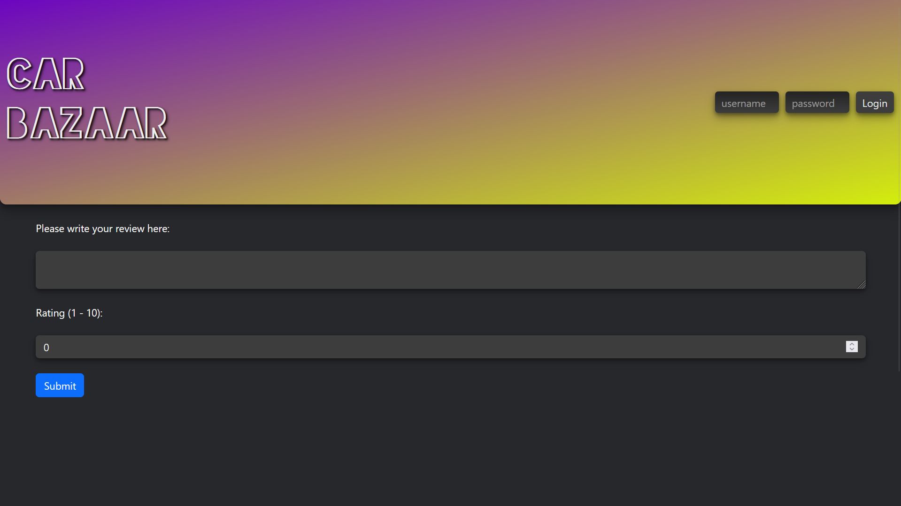

# Car Bazaar
Car trading system - currently under development

### Main screen

### Car listing screen

### Review screen

## Current features:
- Multi car view
- Single car view with info about the listing, reviews and options to buy, share and to leave an opinion
- Logging in
- Leaving reviews
- Car listings sorting
- Server structure
- DB connection
- Main screen displaying car listings
- Adding new cars

## Technologies:
- Python
- React.js  
- MySQL
- Axios
- Pydantic
- FastAPI
- Bootstrap

