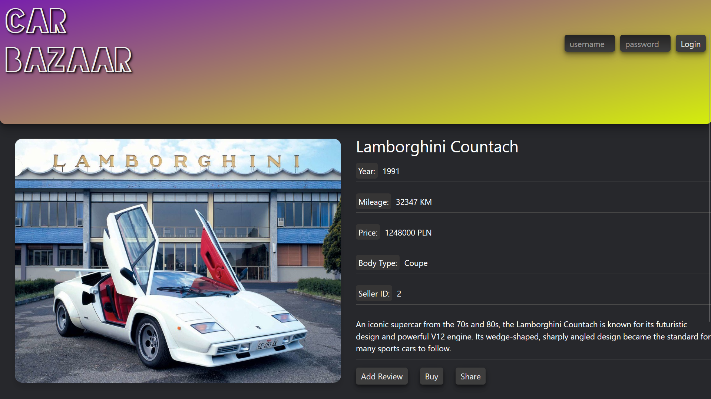
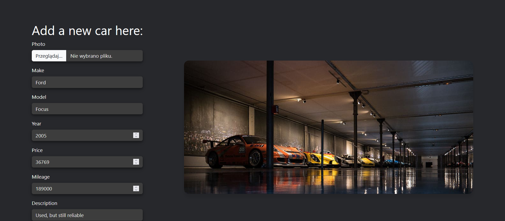
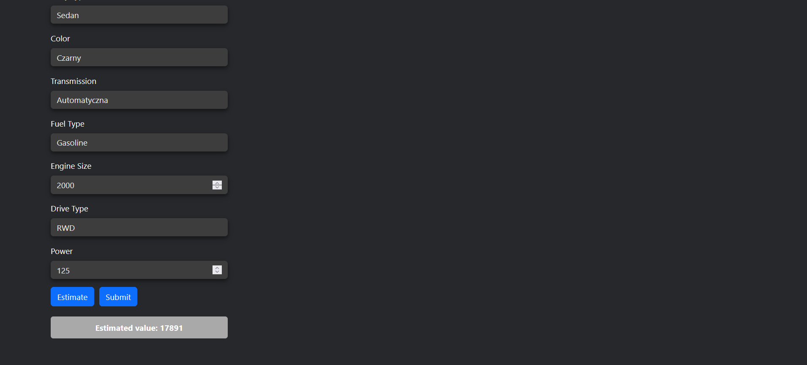

# Car Bazaar


Car Bazaar is a car trading system that allows users to buy and sell cars online. Users can browse through various car listings, view detailed information, reviews and ratings, and contact the sellers. Users can also create their own listings, upload photos, set prices, and receive offers. Car Bazaar aims to make car trading easy, fast, and secure.

## Table of Contents

- [Car Bazaar](#car-bazaar)
  - [Table of Contents](#table-of-contents)
  - [Demo](#demo)
  - [Features](#features)
  - [Installation](#installation)
    - [Prerequisites](#prerequisites)
    - [Backend](#backend)
    - [Frontend](#frontend)
  - [Usage](#usage)
    - [Running the server](#running-the-server)
    - [Running the client](#running-the-client)
  - [Links](#links)

## Demo






## Features

- Multi car view
- Single car view with info about the listing, reviews and options to buy, share and to leave an opinion
- Logging in
- Leaving reviews
- Car listings sorting
- Server structure
- DB connection (sqlite is the engine)
- Main screen displaying car listings
- Adding new cars
- Car price prediction based on a custom neural network.

## Installation

### Prerequisites 

- Python 3.9 or higher
- React.js 17.0.2 or higher~
- Node.js 14.17.1 or higher
- npm 6.14.13 or higher

### Backend

- Clone the repository

```bash
git clone https://github.com/mikgrycz/Car-selling-platform.git
```

- Create and activate a virtual environment

```bash
cd .\Car-selling-platform\
python -m venv venv
.\venv\Scripts\activate
```

- Install the required dependencies

```bash
cd .\Car-selling-platform\car_bazaar\
pip install -r requirements.txt
```

### Frontend

- Install the required dependencies

```bash
cd .\Car-selling-platform\React\car_trading_system>
npm install
```

## Usage

### Running the server

- Start the server

```bash
cd .\Car-selling-platform\car_bazaar\
python manage.py runserver
```

- By default the server will be running on http://localhost:8000


### Running the client

- Start the client

```bash
cd .\Car-selling-platform\React\car_trading_system\
npm start
```

- By default he client will be running on http://localhost:3000

### Testing the ML model of car price prediction
- The easiest way to test the model is through the app's GUI: Log in using login: Mikolaj and password: Mikolaj, 
click the button 'Add a new car', enter your features of choice and click Estimate at the bottom (as in the picture above).
- Another way:
```bash
cd .\Car-selling-platform\car_bazaar\car_bazaar_system\
python Cmd_estimate.py
```
and follow the script's guidance to input the desired features

### Used design patterns

- **Model–View–Controller (MVC)** 
  Model → Model, View → Template, Controller → View function/class. Separates concerns for maintainability and clarity.
  - Model (Car, Photo, User, Transaction)
  - View (React FE)
  - Controller (views.py: get_car, add_user, get_users, get_reviews)
  
- **Data Transfer Object (DTO)**  
  Serializers transfer data across API boundaries.  
  - UserSerializer, CarSerializer, PhotoSerializer, ReviewSerializer 

- **Identity Field**  
  Primary key (`id`, `AutoField`, `UUIDField`) uniquely identifies each entity.
  - Car(id), User(id), Review(id)

- **Foreign Key Mapping** 
  - Car, Review, Listing
  
- **Front Controller**   
  `urls.py` routes all HTTP requests.  

- **Lazy Load**  
  Related objects are loaded only when accessed (`obj.foreignkey`). Prevents unnecessary queries and improves performance.
  - Car, Review, Listing
  
- **Value Object** 
  Immutable value types like `datetime`, `Decimal`, custom fields, money objects.

- **Row Data Gateway** 
  Each model instance maps to one database row (`save()`, `delete()`).


